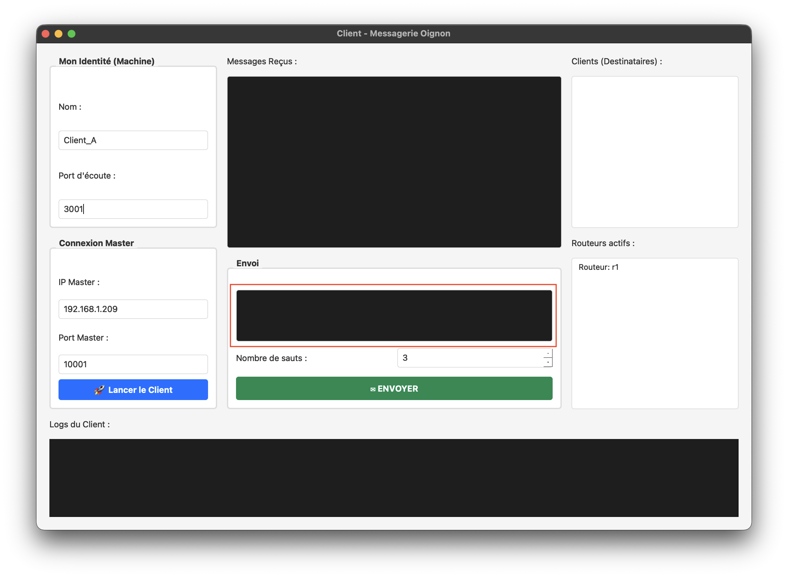
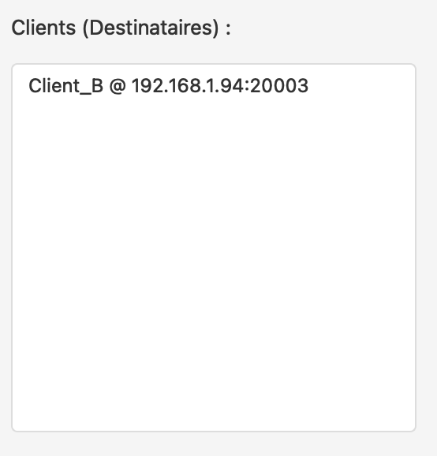

# Client

## Utilité
Le client est le code qui permet de discutté entre les différent client. 

## Run 
Après avoir installé toute les modules en plus et fait ```python -m client.main``` dans le dossier src, vous arriverez sur cette interface: 


Sur la partie de gauche vous trouverez les différentes zone a renseigner comme le nom du client, le port d'écoute, l'ip du master et son port.

Un fois que tout est correctement renseigné vous pouvez lancé le client avec le bouton ```Lancer le Client```.
Si vous renseigné mal les information ou que vous vous trompé dans ip/ port master ou alors que le port d'écoute que vous voulez utilisé est déja pris il sera indiqué dans la console la où vous avez fait ```python -m client.main```, si un message apparait dans cette derniere vérifier les information que vous avez renseigné, et réappuyer sur le bouton ```Lancer le Client```, cependant si vous changé des information, pensez à changé le port d'écoute.

## Envoie de message
Pour envoyer un message il vous suffit de marqué votre texte dans la zone entouré en rouge si dessous : 



et de selectionné un client a droite dans la zone fait pour : 



puis d'appuyer sur envoyer.

## Info 
Si vous augmenté le nombre de saut, le message sera beaucoup plus long à envoyer et à recevoir.

# ⚠️ Attention
Si vous avez l'impression que votre client ne repond plus, juste après avoir envoyer le message, c'est normal c'est parce qu'il est entrain d'envoyer le message. Attendais jusqu'a que votre message s'affiche dans la partie ```Messages Reçus```
