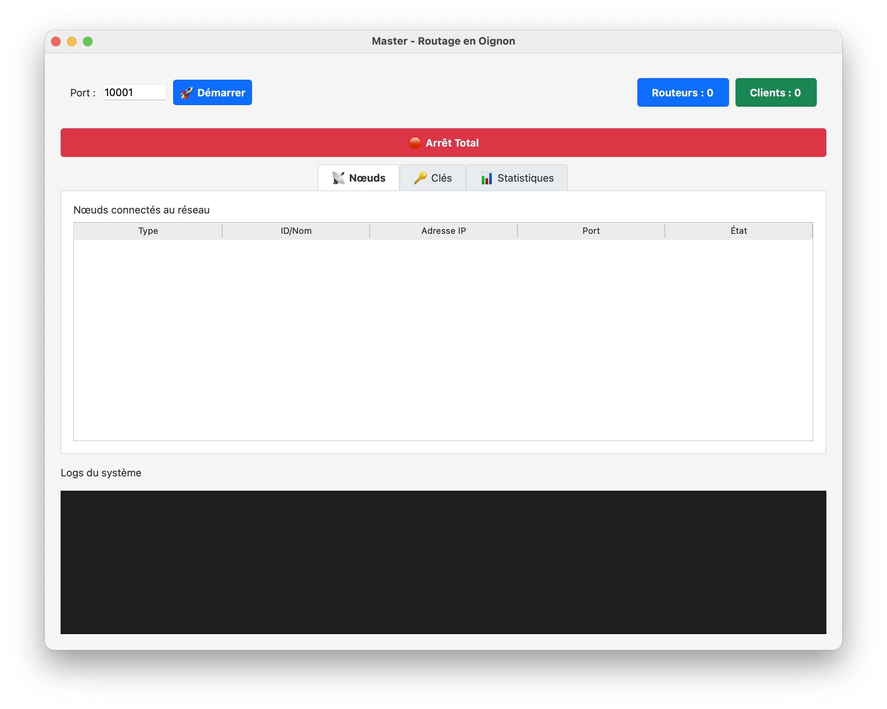

# Master

## Utilité 
Le master gère la base de donné qui est alimenté par les personne qui sont connecté au master, si un personne n'est pas connécter au master elle ne vera rien et ne pour pas envoyer de message vers les autres personnes. 

## RUN
Après avoir installé toute les modules en plus et fait ```python -m master.main "@ip bdd" "user bdd" "mdp bdd"``` dans le dossier src, vous arriverez sur cette interface: 



En haut à gauche vous pouvez renseigné le port sur le qu'elle écoutera le master.
Un fois que vous aurez démarrer vous verrez que la ou vous rensignez le port il passe en grisait.

Quand un router ou un client se renseigne au près du master il apparaitra dans l'interface.
Sur cette dernière vous arrivez directement dans l'onglet "Nœud", dans l'onglet "Clés" vous verez les different router avec leurs clé plublique et dans l'onglet statistique, vous verez le nombres de router et de client connecté au master.

## Technique
Le code du master est découpé en 5 codes, chaque code fait une seul chose, par exemple le code qui fait passerelle entre l'nterface graphique et le coté logique du master se nomme ```UIHandler```. Le main du master est la pour appéller le coté logique et le coté interface graphique du master. Donc le point d'entré quand on lance le master se fait par le main.