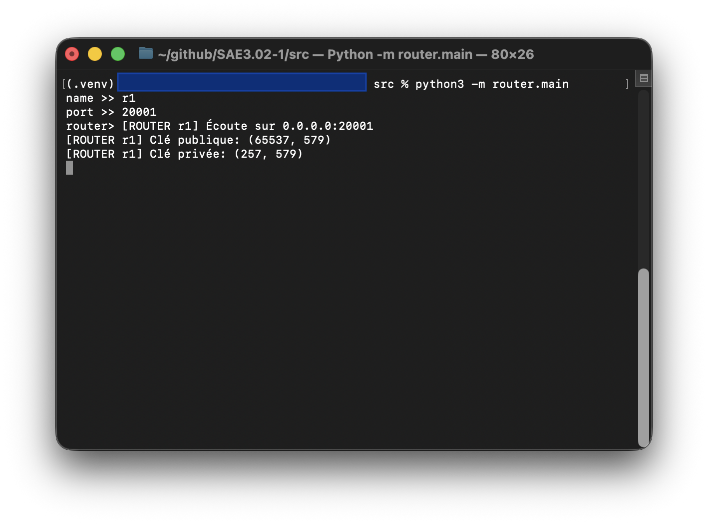

# Router

# Utilité
Le router permet de ne pas envoyer directement le message au destinataire, il permet crée de l'obfuscation sur le trajet des messsages.

## Run
Après avoir installé toute les modules en plus et fait ```python -m router.main "key_size"``` dans le dossier src, vous arriverez sur cette interface: 



L'interface vous demandera de renseigner le nom du router ```name >>``` vous pouvez mettre se que vous voulez, il vous demandera aussi le port d'écoute du router ```port >>``` renseigné un port qui n'est pas déjà utilisé si non le programme vous dira ```Port déjà utilisé``` et s'arrêtera.

Un fois que vous avez renseigné le port le programme affichera le sur quoi il écoute, sa clé publique et privé.
A partir de la vous pouvez faire un /help pour connaitre toute les commandes lier au router, notamment le la commande pour se connecté au master et renseignant l'ip et le port.
ip master : ```
/ip master @ip
```
port master : ```
/port master "port"
```

## Info 
Des qu'il y a une connexion sur le router elle sera affiché, et vers qui il sera transférer.

# ⚠️ Attention
Si vous avez l'impression que le router ne repond plus, c'est qu'il soit entrain d'envoyer un message ou qu'il en reçois un.

Pour savoir si votre router n'est vraiment plus accessible vérifier au près du master si il apparait toujours, si il y est c'est qu'il fait se que je vien de dire un peux plus haut.